## Phase 1
Die Einrichtung einer Cloud beginnt mit dem Clonen des Repositories bzw. Auschecken oder Herunterladen der Quellen. Seit März 2020 sind die Quellen über GitHub verfügbar: 

        git clone https://github.com/ipb-halle/CRIMSy.git

Durch das Clonen wird ein Verzeichnis CRIMSy mit den Quellen angelegt. Alle weiteren Aktionen finden - soweit nichts anderes angegeben ist - in diesem Verzeichnis statt.

Als nächstes muss die Distribution konfiguriert werden. Dies beinhaltet das Anlegen einer Stammzertifizierungsstelle (Root CA) und einer Zertifizierungsstelle für die geplante Cloud (eine Sub-CA). Die Einrichtung erfolgt jeweils mit dem Script `util/bin/camgr.sh`. Alle Konfigurationsdaten der Cloud einschließlich der CAs werden im Source-Tree unterhalb des Verzeichnis config/ gespeichert. Durch eine entsprechende Einstellung in .gitignore ist sichergestellt, dass die Konfiguration nicht in das Sourcecode-Repository eingecheckt wird. Viele Funktionen des `camgr.sh`-Scripts sind menügesteuert und verwenden (weitestgehend) eine Curses-Oberfläche. Einige Parameter (z.B. die Cloud) müssen jedoch über Kommandozeilenoptionen übergeben werden. Andere Funktionen (Ausstellen eines Zertifikats, Erzeugung der Zertifikatssperrliste / Certificate Revocation List - CRL) sind auch über die Kommandozeile zugänglich, da das Skript `camgr.sh` auch in automatisiert ablaufenden Prozessen benutzt wird. Mit der Kommandozeilenoption "--help" kann man sich einen Hilfetext anzeigen lassen. Das Hauptmenü des Scripts sieht wie folgt aus:

{ width=80% }

> **Info:** Das camgr.sh-Script beendet sich momentan nach jedem Schritt und muss demzufolge für einen darauffolgenden Schritt neu gestartet werden.

In einem ersten Schritt muss eine neue CA (= Zertifizierungsstelle) mit einem neuen CA-Zertifikat (Zertifizierungsstellenzertifikat) angelegt werden. Das aktuelle Betriebskonzept sieht eine dreistufige Zertifikatshierarchie vor: An oberster Stelle steht eine Stammzertifizierungsstelle (Root-CA), die Zertifikate für weitere Zertifizierungsstellen (Sub-CAs bzw. Zwischen-CAs) ausstellt. Es ist nicht vorgesehen, dass die Root-CA Zertifikate für Knoten ausstellt. Die Sub-CAs (eine Sub-CA für jede Cloud) stellen die Zertifikate für Knoten ihrer jeweiligen Cloud aus. Auf der untersten Ebene erhält jeder Knoten ein Zertifikat der Zertifizierungsstelle (Sub-CA) seiner Cloud. 

> **Info:** Ursprünglich (d.h. in der _Leibniz Bioactives Cloud_) wurden die Zertifikate für die Knoten direkt von der Root-CA ausgestellt. Da CRIMSy einen dezentralen Ansatz verfolgt, können die Sub-CAs von unterschiedlichen Root-CA beglaubigt werden.

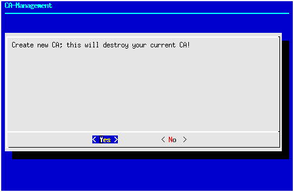{ width=80% }

Sofern noch keine Root-CA existiert, die die Sub-CA für eine Cloud beglaubigt, sollte zunächst eine neue Root-CA angelegt werden. Rufen Sie dazu `camgr.sh` ohne Kommandozeilenargumente auf und wählen Sie Menüpunkt 9. Es ist möglich, ohne eigene Root-CA zu arbeiten, und die Sub-CA der Cloud von einer fremden Root-CA zertifizieren zu lassen. Das Script `camgr.sh` unterstützt jedoch hauptsächlich ein spezifisches Szenario, so dass abweichende Szenarien manuelle Eingriffe nötig machen können. **Achtung: Beim Anlegen einer neuen CA wird eine eventuell bestehende CA zerstört!**

{ width=50% } { width=50% }
Wie in der Abbildung zu sehen, werden im nächsten Schritt die Daten für die Root-CA abgefragt. Daran schließt sich eine Überprüfung der Daten an.

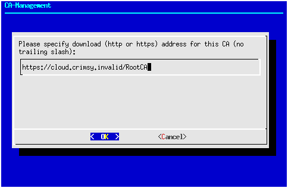{ width=50% } 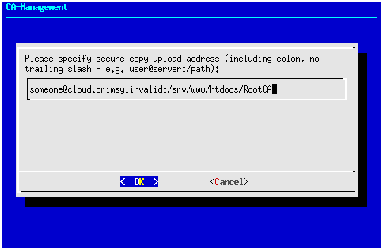{ width=50% }
Für die Root-CA müssen außerdem eine Download-URL und eine _Secure Copy_-Adresse angegeben werden (beide ohne _trailing slash_). Über die Download-URL sind das Zertifikat der CA, die Sperrliste (CRL) sowie weitere öffentliche Informationen abrufbar. Aus der URL wird die URL der Zertifikatssperrliste durch Anhängen von `crl.pem` gebildet und in das Zertifikat übertragen. Die URL im Zertifikat kann später nicht mehr geändert werden! Die _Secure Copy_-Adresse dient dazu, das Zertifikat, die Sperrliste und weitere Informationen (einen Java-Truststore und eine Adressliste) hochzuladen.  Idealerweise sollte `scp` mit Public Key Authentifizierung konfiguriert sein, damit die Kopiervorgänge ohne Passworteingabe funktionieren.

Für die Einrichtung eine Sub-CA für die Cloud `TEST` muss das Skript mit der Option `--cloud TEST` aufgerufen werden:

        ./util/bin/camgr.sh --cloud TEST

Die nächsten Schritte (Warnhinweis, Erfassung und Prüfung der Daten, Download-URL und _Secure Copy_-Adresse) laufen dann zunächst analog zur Einrichtung der Root-CA ab: 

!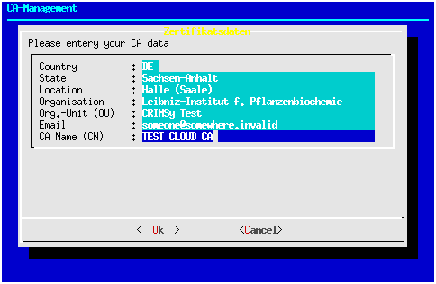{ width=50% } 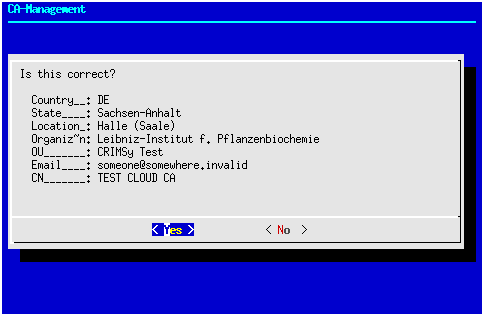{ width=50% } 

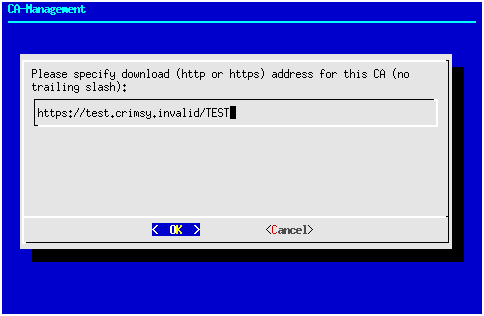{ width=50% } 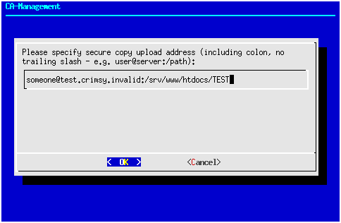{ width=50% } 

Die Unterschiede beginnen, wenn die Download-URL der übergeordneten CA (***superior***, also der Root-CA) abgefragt wird. Falls Sie die übergeordnete CA selbst betreiben, geben Sie bitte die gleiche URL wie bei der Erstellung der Root-CA an: 

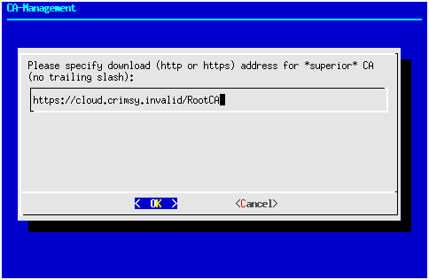
Falls Sie die Root-CA nicht selbst betreiben, müssen Sie sicherstellen, dass alle benötigten Informationen unter der Download-URL verfügbar sind:

* die Zertifikatskette der übergeordneten CA in der Datei `chain.txt`; auf diese Weise sind auch mehrstufige CA-Hierarchien möglich
* die Zertifikatssperrliste in der Datei `crl.pem`
* ein Java-Keystore mit allen Zertifikaten der Zertifikatskette in der Datei `truststore` sowie das zugehörige Keystore-Passwort in der Datei `truststore.passwd`
* eine Datei `addresses.txt` mit dem (Kurz-)Namen der CAs, _subject hashes_, Fingerprints, sowie den URLs von CA-Zertifikat und CRL aller Zertifikate der Zertifikatskette; 5 Spalten jeweils durch Tabulator getrennt.

Obwohl im Dialog nur die Protokolle `http:` bzw. `https:` angegeben sind, können Sie hier ausnahmsweise auch `file:` benutzen.  Das Skript `camgr.sh` wird dann die Dateien der übergeordneten CA in das Verzeichnis der Sub-CA kopieren und einen Zertifikatsrequest für die Sub-CA erstellen. Im nächsten Schritt muss anhand dieses Zertifikatsrequests ein Zertifikat für die Sub-CA ausgestellt werden. Falls Sie die übergeordnete CA nicht selbst betreiben, müssen Sie den Zertifikatsrequest (die Datei `config/.../CA/cacert.req`) an die übergeordnete CA übermitteln. Ansonsten reicht der Aufruf der beiden Kommandos (hier gezeigt am Beispiel einer Cloud `TEST`):

    ./util/bin/camgr.sh --mode sign \
      --extension v3_subCA \
      --input ./config/TEST/CA/cacert.req \
      --output ./config/TEST/CA/cacert.pem

    ./util/bin/camgr.sh --mode importSubCA \
      --cloud TEST

Das erste Kommando veranlasst die Ausstellung des Zertifikats mit der Erweiterung `v3_subCA` durch die Root-CA, so das mit diesem Zertifikat andere Zertifikate beglaubigt werden können. Die Pfade können entweder absolut oder relativ zum aktuellen Verzeichnis angegeben werden.

Das zweite Kommando "importiert" anschließend das Zertifikat und stellt schon praktisch die Betriebsbereitschaft der Sub-CA her. Zu guter Letzt sollte aber noch der Langname der Cloud gesetzt werden:

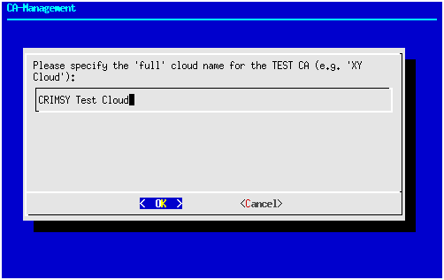
Dabei ist zu beachten, dass das Skript `camgr.sh` immer mit der Option `--cloud` und dem Kurznamen der Cloud (z.B. `TEST`)aufgerufen werden muss: 

    ./util/bin/camgr.sh --cloud TEST

da ansonsten die Einstellungen der Root-CA verändert werden.

Für die Funktion der Cloud sind aktuelle Zertifikatssperrlisten notwendig. Am besten werden diese regelmäßig (z.B. 1x täglich) durch einen CRON-Job aktualisiert. Es ist wichtig, sämtliche Zertifikatssperrlisten der Zertifikatskette aktuell zu halten. Ein CRON-Eintrag könnte wie folgt aussehen:

    #
    # CRL erzeugen
    #
    #Min Hour Day Month Week Cmd
    # Root-CA
    20 10 * * * /home/someone/git/CRIMSy/util/bin/camgr.sh --mode genCRL 2>/dev/null >/dev/null
    #
    # Sub-CA
    21 10 * * * /home/someone/git/CRIMSy/util/bin/camgr.sh --mode genCRL --cloud TEST 2>/dev/null >/dev/null

Der CRON-Job sollte zum selben Nutzer gehören, der auch die Quellen ausgecheckt hat.

Für die Absicherung der Softwarepakete durch digitale Signaturen wird ein Entwicklerzertifikat benötigt. Dies kann ebenfalls mit dem Skipt `camgr.sh` ausgestellt werden. Es ist darauf zu achten, dass das Entwicklerzertifikat von der CA der jeweiligen Cloud ausgestellt wurde. Entwickler-Zertifikate der Root-CA sind momentan ohne Nutzen. Nachfolgend ist die Ausstellung eines Entwicklerzertifikats für die Cloud `TEST` illustriert (d.h. Aufruf des Skripts mit `./util/bin/camgr.sh --cloud TEST`). Im Skript ist dazu Menüpunkt 2 "Create Certificate (Developer)" aufzurufen:

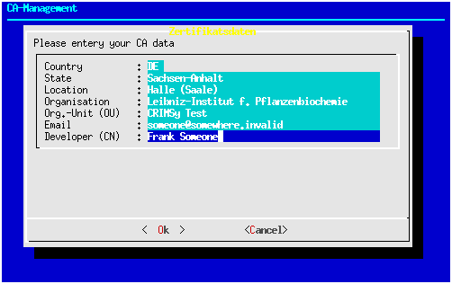

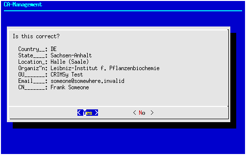{ width=50% } 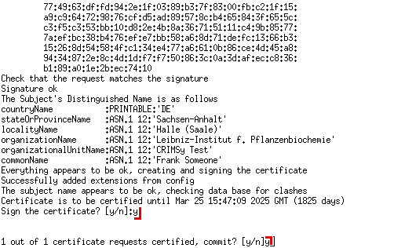{ width=50% }
Wie üblich schließen sich daran die Überprüfung der Eingaben und die Bestätigung der Zertifikatsausstellung an.

Die erste Setup-Phase schließt mit dem Hochladen des Konfigurationsscripts ab. Dies erfolgt ganz einfach durch Aufruf des Skripts `upload.sh` mit dem Kurznamen der Cloud als Argument:

    ./util/bin/upload.sh TEST

Anschließend muss unter der Download-Adresse der Distribution in etwa folgende Seite aufrufbar sein:

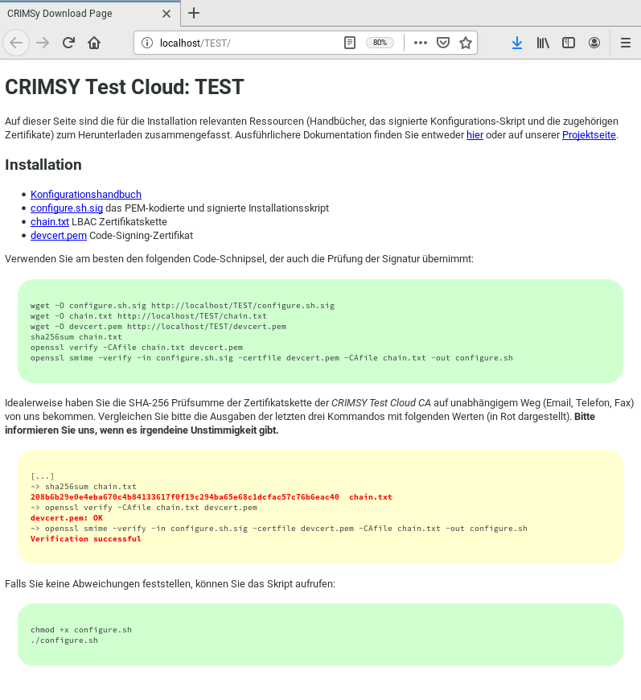
In der zweiten Phase müssen die einzelnen Knoten der Cloud und vor allem der Master-Knoten konfiguriert werden. Ausgangspunkt ist die eben erwähnte Distributions-Seite. Die genaue Vorgehensweise ist im Manual Konfiguration und Installation und speziell im Abschnitt Konfigurationsskript beschrieben.

