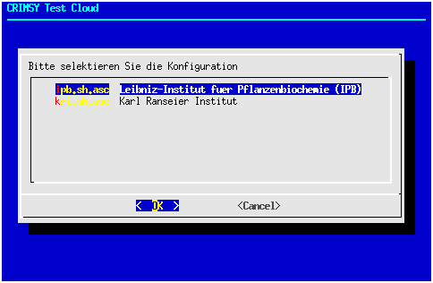
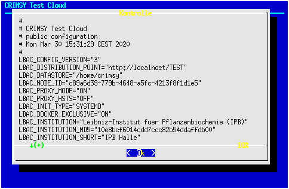
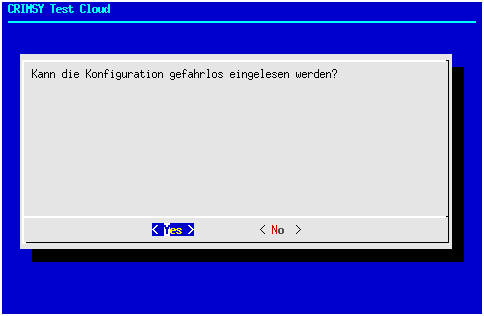
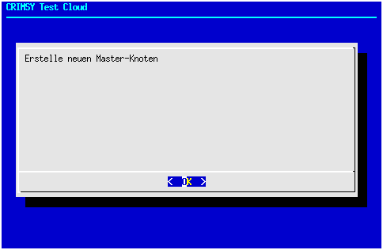
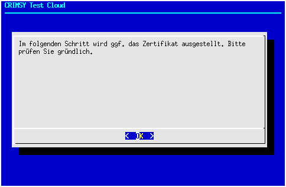
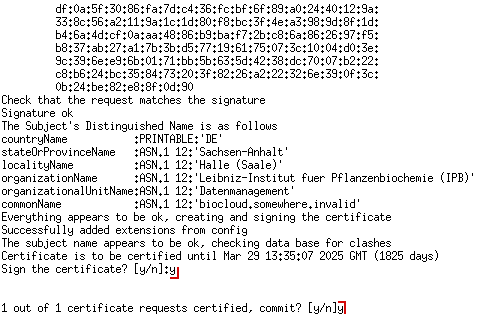
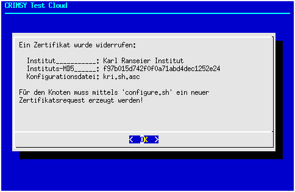

# Phase 2
Die zweite Phase beginnt damit, dass der Distributor den Quellcode übersetzt:

    mvn package

Anschließend müssen einige zusätzliche Java-Bibliotheken im Verzeichnis `config/extralib/` bereitgestellt werden, damit Hibernate zusammen mit TomEE funktioniert (Näheres unter [https://stackoverflow.com/questions/10852035/how-to-use-tomee-with-hibernate](https://stackoverflow.com/questions/10852035/how-to-use-tomee-with-hibernate)). Im Einzelnen handelt es sich um die Bibliotheken (ggf. in neueren Versionen):

        antlr-2.7.7.jar
        classmate-1.3.0.jar
        dom4j-1.6.1.jar
        hibernate-commons-annotations-5.0.1.Final.jar
        hibernate-core-5.2.6.Final.jar
        hibernate-jpa-2.1-api-1.0.0.Final.jar
        hibernate-validator-5.2.4.Final.jar
        javassist-3.20.0-GA.jar
        jboss-logging-3.3.0.Final.jar
        postgresql-9.3-1102.jdbc4.jar

Zwischenzeitlich wurden (bzw. nachfolgend werden) die verschlüsselten Konfigurationsdateien der Teilnehmerknoten empfangen und im Verzeichnis config/nodes/ abspeichert. Diese Dateien sollten zuvor einer Sichtprüfung unterzogen werden. Das Format der Konfigurationsdateien sollte folgendem Muster entsprechen:

    #
    # LBAC_INSTITUTION=IPB Demo
    # CERTIFICATE_ID=06:30:D8:B9:86:54:B5:69:CF:79:3F:C9:A9:BC:D4:8F:D8:94:39:78
    # Wed Oct 10 14:30:29 UTC 2018
    #
    # ----- SMIME ENCRYPTED CONFIG BEGIN -----
    -----BEGIN PKCS7-----
    MIINnQYJKoZIhvcNAQcDoIINjjCCDYoCAQAxggLBMIICvQIBADCBpDCBnjELMAkG
    [...]
    YnVrNTz4AlCAvtlG+QDZrbaw/iwAUkaLVI+Hk/mMpB9e
    -----END PKCS7-----
    # ----- SMIME ENCRYPTED CONFIG END -----

Der entscheidende Schritt in Phase 2 ist die Festlegung des Master-Knotens und des Cloudnamens, wobei letzerer identisch mit dem Namen der Sub-CA ist. Ein Cloudname wie "TEST", "CLOUD" oder "PRODUKTION" ist vollkommen ausreichend; es dürfen jedoch innerhalb einer Multi-Cloud keine Kollisionen des Namens vorkommen. In den oben angeführten Beispielen wurde der Cloudname "CRIMSY Test Cloud" bzw. kurz "`TEST`" verwendet.

Der Masterknoten wird durch Aufruf des Scripts util/bin/package.sh festgelegt. Ohne weiteres Argument gibt das Script eine kurze Syntaxinformation aus. Ansonsten gibt es für das Script drei Einsatzszenarien:

1. Festlegung des Masterknotens: Aufruf mit `./util/bin/package.sh CLOUDNAME MASTER`
2. Hinzufügen eines Knotens zur Cloud: Aufruf mit `./util/bin/package.sh CLOUDNAME`
3. Neuzusammenstellung der Installationspakete aller aus dem Verzeichnis `config/CLOUDNAME/` bekannten Knoten, z.B. bei einer neuen Software-Version: `./util/bin/package.sh CLOUDNAME AUTO`

Während Szenario 3 später automatisch durchläuft, öffnen sich in den Szenarien 1 und 2 die nachfolgend dargestellten Dialoge zur Auswahl eines Knotens:

Zunächst kann aus der Liste der eingesendeten Konfigurationsdateien (`config/nodes/`) der zukünftige Master-Knoten bestimmt werden

Anschließend wird die Konfigurationsdatei geöffnet. **Hier muss unbedingt gründlich geprüft werden, ob von den angezeigten Daten eine Gefahr ausgeht, da die Konfiguration anschließend im den Kontext der aktuellen Shell interpretiert wird!** Gefährlich sind Aufrufe von Kommandos (pars pro toto das berüchtigte rm -f /) die sich mittels Backticks auch in Variablenzuweisungen verstecken können (konkretes Beispiel: LBAC_DATASTORE="/home/`rm -rf /`cloud/"). Selbstverständlich sollte die angezeigte Institution auch mit der zuvor getätigten Auswahl korrespondieren.

**Wichtig: gründlich prüfen, eine bösartige Konfigurationsdatei kann beliebig großen Schaden anrichten!**

Das Ergebnis der Prüfung wird anschließend abgefragt.

{ width=50% } { width=50% }
Bei der Erstellung eines Master-Knotens erscheint der links oben angeführte Informations-Dialog, der bei regulären Knoten entfällt. Darauf folgt ein Dialog, der darüber informiert, dass die Ausstellung des Knoten-Zertifikats unmittelbar bevorsteht.

Die Ausstellung des Zertifikats verläuft analog zur Ausstellung des Entwickler- oder Zertifizierungsstellenzertifikats (Sub-CA). Der Zertifikatsrequest ist in der übermittelten Konfigurationsdatei enthalten. Falls für einen Knoten bereits zu einem früheren Zeitpunkt ein Zertifikat ausgestellt wurde, wird dieses wiederverwendet, sofern es noch nicht widerrufen wurde. Ein widerrufenes Zertifikat erfordert zwingend die Einsendung einer neuen Konfigurationsdatei mit einem neu ausgestellten Zertifikatsrequest. Die Identifizierung des möglicherweise existierenden Zertifikats erfolgt über die md5-Summe des Zertifikatsrequests.

Anschließend werden vom Script ohne weiteren Nutzereingriff

* alle Artefakte im Verzeichnis `target/dist/` gesammelt
* mittels `tar`, `gzip` und `uuencode` in ein komprimiertes, Base64-kodiertes Archiv gepackt und
* an die Datei `setup.sh` angehängt. Der entstehende Datenstrom wird
* mittels `openssl smime` mit dem öffentlichen Schlüssel des Empfängerknotens verschlüsselt
* und dem Entwicklerzertifikat signiert. Das fertige Installationspaket wird anschließend
* mittels `scp` auf den Distributionsserver hochgeladen.

Für den Multi-Cloud-Betrieb wird außerdem ein kompaktes tar-Archiv ohne Software erstellt, das nur die Zertifikatskette, Truststores und Informationen über den Master-Knoten enthält. Dadurch wird es möglich, dass ein Knoten Mitglied in mehreren Clouds ist. Gleichzeitig wird durch unterschiedliche SubCAs sichergestellt, das nur Mitgliedsknoten miteinander kommunizieren können.

Die Aufgaben des Distributors sind damit zunächst erledigt. Im weiteren Verlauf werden die Administratoren der einzelnen Knoten die Installation gemäß Handbuch (Konfiguration und Installation) durchführen. Zweckmäßigerweise sollte der Masterknoten als erster Knoten eingerichtet werden.

## Management
Die Managementaufgaben des Distributors umfassen neben allgemeinen Wartungsaufgaben (Überwachung der Dienste, Patch-Management, ...) vor allem die Verwaltung der Zertifikate und der Konfigurationsdateien. Der Widerruf eines Zertifikats kann dabei sowohl bei Kompromittierung als auch beim Ausscheiden einer Cloud-Instanz notwendig werden. In diesem Fall dürfen für den betroffenen Knoten keine Softwarepakete mehr erstellt werden. Insbesondere muss auch sichergestellt werden, dass der Zertifikatsrequest nicht wiederverwendet wird (der private Schlüssel könnte kompromittiert sein).

Trifft das Script package.sh auf eine Konfiguration mit wiederrufenem Zertifikat, wird eine Warnmeldung ausgegeben und das Skript beendet.

Die fragliche Konfigurationsdatei mit dem Zertifikatsrequest muss manuell gelöscht oder verschoben werden.

