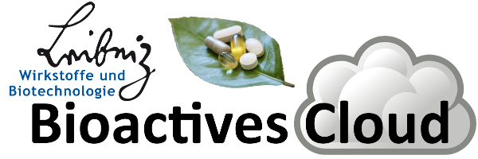

# Vorwort
Dieses Handbuch unternimmt den Versuch die Architektur und die Gründe für diverse Architekturentscheidungen zu beschreiben. Das Struktur des Handbuchs versucht, sich am Arc42 Template zu orientieren.

© We acknowledge that this document uses material from the arc 42 architecture template, http://www.arc42.de. Created by Dr. Peter Hruschka & Dr. Gernot Starke.

CRIMSy (Cloud Resource & Information Management System) war und ist gewissermaßen das 'Betriebssystem der Leibniz Bioactives Cloud'. Großzügig durch den Leibniz-Forschungsverbund "Wirkstoffe und Biotechnologie" gefördert, startete das Projekt als "Leibniz Bioactives Cloud" (daher an vielen Stellen die Abkürzung "LBAC"). Ein neuer Name wurde notwendig, weil auch andere Verbünde bzw. Allianzen Interesse an der Nutzung und Weiterentwicklung der Software angemeldet haben. Stand März 2020 fördern der _[Leibniz-Forschungsverbund "Wirkstoffe und Biotechnologie"](https://www.leibniz-wirkstoffe.de/)_ und der _[Interdisziplinäre Verbund "Autonomie im Alter"](http://autonomie-im-alter.ovgu.de)_ die Weiterentwicklung der Software.

# Einführung
Das Projekt "Leibniz Bioactives Cloud" wurde vom [Leibniz-Forschungsverbunds "Wirkstoffe und Biotechnologie"](https://www.leibniz-wirkstoffe.de) initiiert, um den Wissenschaftlern der beteiligten Institute ein "Smart Data Warehouse" als Forschungswerkzeug zur Verfügung zu stellen. Das "Smart Data Warehouse" soll als dezentral organisierte Web-Anwendung entwickelt werden. Gründe für die dezentrale Organisation sind nicht zuletzt verschiedene rechtliche Fragen (unter anderem Haftung und Finanzierung), deren Beantwortung in einem zentralistischen Ansatz für das Projektteam als unlösbar eingestuft wurden. Die unterschiedlichen Rechtsformen der beteiligten Institute haben hierbei durchaus eine Rolle gespielt. Als "Smart Data Warehouse" erschließt die Leibniz Bioactives Cloud den Forschern Dokumente (z.B. Jahresberichte, Masterarbeiten und sonstige graue Literatur), auf die sie sonst keinen oder nur umständlichen Zugriff haben. Das Attribut "Smart" impliziert dabei, dass die Forscher auch mit unscharfen Begriffen operieren können und das System selbständig Zusammenhänge herstellt. Beispielsweise soll das System bei einer Suche mit dem Begriff "Brassicaceae" (die Pflanzenfamilie Kreuzblütler) auch Dokumente finden, in denen der Begriff "Arabidopsis" (die zu den Kreuzblütlern gehörende Gattung Schaumkressen) vorkommt. Stichworte in diesem Zusammenhang sind "semantische Annotation", "Ontologien" und "Natural Language Processing". Weiterhin ist geplant, den Forschern eine Plattform zur Verfügung zu stellen, in der sie Know-How oder Services anbieten oder nachfragen können (Marktplatz / Schwarzes Brett). Schließlich soll die Leibniz Bioactives Cloud die Möglichkeit zum Austausch von Datensätzen, beispielsweise Substanzdatenbanken oder Assay-Ergebnisse, bieten.

Die Software muss dabei strenge Qualitätsmaßstäbe erfüllen:

* An erster Stelle steht eine durchgehende Berücksichtigung von Sicherheitsaspekten beginnend beim Entwurf über die Implementierung bis zum Betrieb, um das Betriebsrisiko für die teilnehmenden Institute zu minimieren. Dies bedeutet, nur sichere Verfahren und Algorithmen einzusetzen, sicherheitsrelevante Entscheidungen zu dokumentieren und die Notwendigkeit von Sicherheitsupdates von Anfang an einzukalkulieren.
* Die Software soll ihren Nutzern durch innovative Funktionen Mehrwert bieten
* Die Software soll durch zeitgemäßes Design und Nutzerfreundlichkeit Lust auf die Arbeit mit ihr machen

## Stakeholder
Die Entwicklung orientiert sich zunächst stark am Projektantrag für den Leibniz Forschungsverbund "Wirkstoffe und Biotechnologie". Als Auftraggeber bestimmt die Mitgliederversammlung des Forschungsverbunds die Richtung der Entwicklung. Der Sprecher und die Koordinatoren des Forschungsverbunds stehen ebenfalls beratend zur Seite. Für technische Fragen im Zusammenhang mit dem Roll-Out stehen wir in Kontakt mit den IT-Verantwortlichen in den Mitgliedsinstituten. Die einzelnen Beteiligten nehmen dabei verschieden Rollen wahr:

* _Wissenschaftler_ sind die primäre Zielgruppe des Projekts. Als Anwender haben sie maßgeblichen Einfluss auf die Richtung der Entwicklung. Diese Gruppe beinhaltet sowohl "normale" Wissenschaftler als auch die Institutsdirektoren bzw. Sprecher des Forschungsverbunds.
* _Systemadministratoren_ betreiben in ihrer Gesamtheit die verteilte Infrastruktur und sind mitverantwortlich (jeweils an ihrem Institut) für die Absicherung der Cloud (z.B. durch Firewalls, Backup, ...).
* _Koordinatoren_ unterstützen die Arbeit durch Beratung und organisatorische Hilfen.
* _Entwickler_ Führen alle wesentlichen Schritte der Softwareentwicklung (Konzeption, Umsetzung, Tests, Dokumentation, Auslieferung) durch.

Die Kontaktdaten der beteiligten Personen können aus Datenschutzgründen nicht in diesem Dokument aufgelistet werden.

